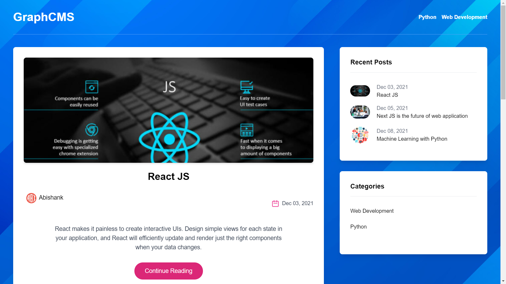
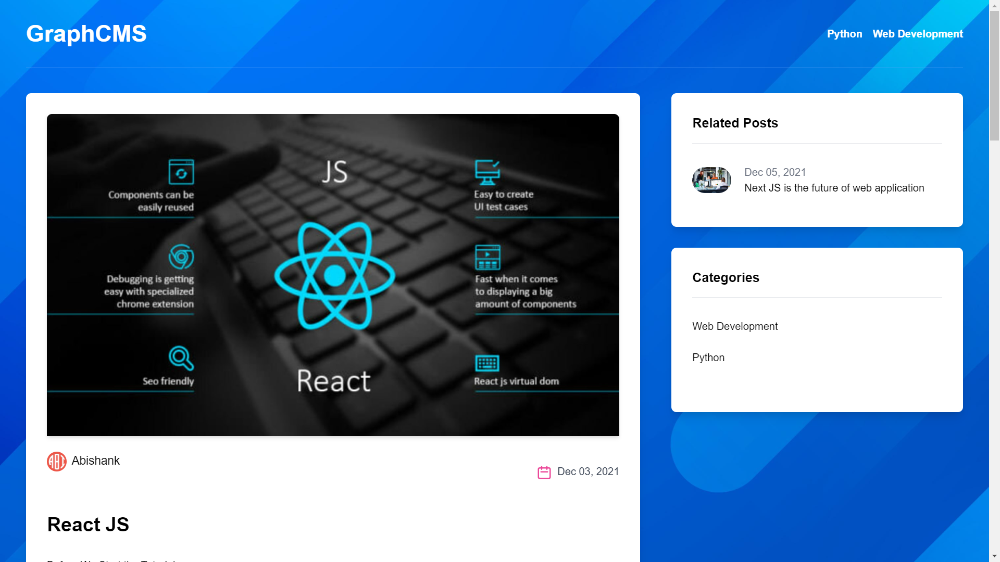
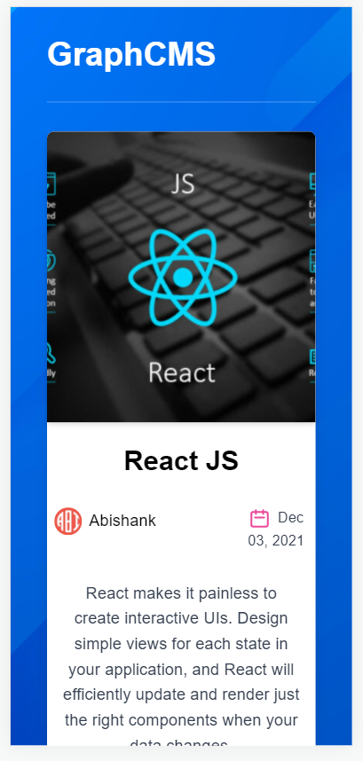
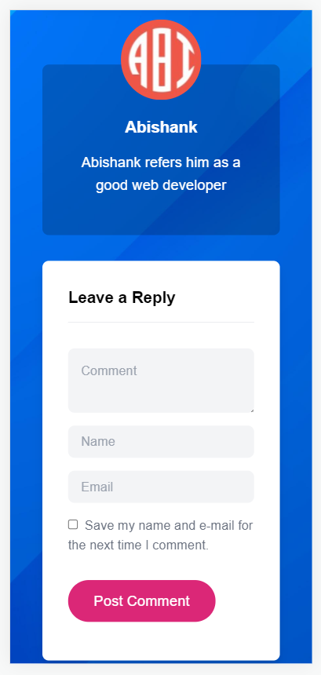

# BLOG NEXTJS APP
Using nextJS, tailwindCSS, and GraphCMS I have build this nextjs web application. In this app people can post their blog with the contact of the developer of this nextJS app.

And it is also Mobile Responsibe.


## Link of the Website
[click here to check the website](https://blog-next-js-app.vercel.app/)


## Screenshots











## Run The Project

Setup:

```bash
    run npm i && npm run dev
```
